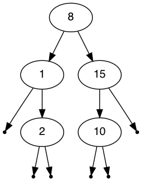

# CPSC 223p
##  Binary Tree

Write a program named `binarytree.py` which takes a positive integer as an argument. The program will generate a list of numbers from 0 to the given positive integer. The list is then randomly shuffled and the numbers are inserted into a binary search tree in the given order starting from the zeroth location.

Next the tree is written to a file in DOT format, name this file `a.dot` Once it is written to a file, the list of numbers is shuffled again and the first third of the list is removed from the tree. The tree is again written to a file in DOT format, name this file `b.dot`. Next, without shuffling the list, remove the next third of the numbers in the list from the tree. Write the resulting tree to a file in DOT format. Name this file `c.dot`.

To convert the output files to images, use the `dot` command. For example `dot -Tpng a.dot > a.png` will write the a.dot file to a PNG image file. If you'd like to output PDF files instead change the `-Tpng` to `-Tpdf`. See the `dot` commands manual page for more details.

The DOT format is straightforward. Review the examples given below to gain an insight into the syntax.

The `dot` command is part of the graphviz package and it may need to be installed independently on your system. On Debian & Ubuntu systems it can be installed with the command `apt install graphviz`.

Please use the algorithms given in the file `binary_search_tree_algorithms.pdf`.

You must create at least two classes. The Tree object is composed of TreeNode objects. Define the TreeNode class in a file named treenode.py. Define the Tree class in a file named tree.py. Write your application in a file named bintreedemo.py.

Some example Python code to demonstrate how to write out a tree to a file in DOT format is given below.
```
def write(t, out):
  def _writeNull(n, nullcount, out):
    out.write('\tnull' + str(nullcount) + ' [shape=point];\n')
    out.write('\t' + str(n.key) + ' -> null' + str(nullcount) + ';\n')
  
  def _writeHelper(n, out, nullcount):
    if n.left != None:
      out.write( '\t' + str(n.key) + ' -> ' + str(n.left.key) + ';\n')
      nullcount = _writeHelper( n.left, out, nullcount)
    else:
      nullcount += 1
      _writeNull(n, nullcount, out)
    if n.right != None:
      out.write( '\t' + str(n.key) + ' -> ' + str(n.right.key) + ';\n')
      nullcount = _writeHelper(n.right, out, nullcount)
    else:
      nullcount += 1
      _writeNull(n, nullcount, out)
    return nullcount

  out.write('digraph BST{\n')
  out.write('\tnode [fontname="Helvetica"];\n')
  if t.root == None:
    out.write('\n')
  elif t.root.right == None and t.root.left == None:
    out.write('\t' + str(t.root.key) + ';\n')
  else:
    _nullCount = 0
    _writeHelper( t.root, out, _nullCount )
  out.write('}\n')

```


## Example Output
```
$ ./python binarytree.py  15
Randomly inserting the numbers from 1 to 15.
inserted 6
inserted 7
inserted 12
inserted 1
inserted 8
inserted 11
inserted 13
inserted 4
inserted 15
inserted 14
inserted 9
inserted 3
inserted 5
inserted 2
inserted 10
removed 3
	completed.
removed 14
	completed.
removed 6
	completed.
removed 9
	completed.
removed 7
	completed.
removed 4
	completed.
removed 13
	completed.
removed 11
	completed.
removed 12
	completed.
removed 5
	completed.
$ dot -Tpdf a.dot a.pdf
```


#### a.dot
```
digraph BST{
	node [fontname="Helvetica"];
	6 -> 1;
	null1 [shape=point];
	1 -> null1;
	1 -> 4;
	4 -> 3;
	3 -> 2;
	null2 [shape=point];
	2 -> null2;
	null3 [shape=point];
	2 -> null3;
	null4 [shape=point];
	3 -> null4;
	4 -> 5;
	null5 [shape=point];
	5 -> null5;
	null6 [shape=point];
	5 -> null6;
	6 -> 7;
	null7 [shape=point];
	7 -> null7;
	7 -> 12;
	12 -> 8;
	null8 [shape=point];
	8 -> null8;
	8 -> 11;
	11 -> 9;
	null9 [shape=point];
	9 -> null9;
	9 -> 10;
	null10 [shape=point];
	10 -> null10;
	null11 [shape=point];
	10 -> null11;
	null12 [shape=point];
	11 -> null12;
	12 -> 13;
	null13 [shape=point];
	13 -> null13;
	13 -> 15;
	15 -> 14;
	null14 [shape=point];
	14 -> null14;
	null15 [shape=point];
	14 -> null15;
	null16 [shape=point];
	15 -> null16;
}
```


#### b.dot
```
digraph BST{
	node [fontname="Helvetica"];
	8 -> 1;
	null1 [shape=point];
	1 -> null1;
	1 -> 4;
	4 -> 2;
	null2 [shape=point];
	2 -> null2;
	null3 [shape=point];
	2 -> null3;
	4 -> 5;
	null4 [shape=point];
	5 -> null4;
	null5 [shape=point];
	5 -> null5;
	8 -> 12;
	12 -> 11;
	11 -> 10;
	null6 [shape=point];
	10 -> null6;
	null7 [shape=point];
	10 -> null7;
	null8 [shape=point];
	11 -> null8;
	12 -> 13;
	null9 [shape=point];
	13 -> null9;
	13 -> 15;
	null10 [shape=point];
	15 -> null10;
	null11 [shape=point];
	15 -> null11;
}
```


#### c.dot
```
digraph BST{
	node [fontname="Helvetica"];
	8 -> 1;
	null1 [shape=point];
	1 -> null1;
	1 -> 2;
	null2 [shape=point];
	2 -> null2;
	null3 [shape=point];
	2 -> null3;
	8 -> 15;
	15 -> 10;
	null4 [shape=point];
	10 -> null4;
	null5 [shape=point];
	10 -> null5;
	null6 [shape=point];
	15 -> null6;
}
```

