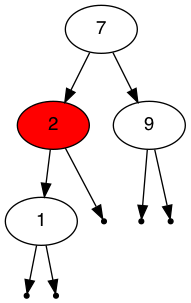

# CPSC 223p
##  Red Black Tree

Write a program named `rbtreedemo.py` which takes a positive integer as an argument. The program will generate a list of numbers from 0 to the given positive integer. The list is then randomly shuffled and the numbers are inserted into a binary search tree in the given order starting from the zeroth location.

Next the tree is written to a file in DOT format, name this file `a.dot` Once it is written to a file, the list of numbers is shuffled again and the first third of the list is removed from the tree. The tree is again written to a file in DOT format, name this file `b.dot`. Next, without shuffling the list, remove the next third of the numbers in the list from the tree. Write the resulting tree to a file in DOT format. Name this file `c.dot`.

To convert the output files to images, use the `dot` command. For example `dot -Tpng a.dot > a.png` will write the a.dot file to a PNG image file. If you'd like to output PDF files instead change the `-Tpng` to `-Tpdf`. See the `dot` commands manual page for more details.

The DOT format is straightforward. Review the examples given below to gain an insight into the syntax.

The `dot` command is part of the graphviz package and it may need to be installed independently on your system. On Debian & Ubuntu systems it can be installed with the command `apt install graphviz`.

Please use the algorithms given in the file `redblack_tree_algorithms.pdf`.

You must create at least two classes. The RBTree object is composed of RBTreeNode objects. Define the RBTreeNode class in a file named rbtreenode.py. Define the RBTree class in a file named rbtree.py. Write your application in a file named rbtreedemo.py.

Use the code you developed from your previous exercise as a starting point for this exercise.

## Example Output
```
$ ./python rbtreedemo.py  12
Randomly inserting the numbers from 1 to 12.
inserted 6
inserted 7
inserted 12
inserted 1
inserted 8
inserted 11
inserted 4
inserted 9
inserted 3
inserted 5
inserted 2
inserted 10
removed 3
	completed.
removed 6
	completed.
removed 10
	completed.
removed 8
	completed.
removed 4
	completed.
removed 11
	completed.
removed 12
	completed.
removed 5
	completed.
$ dot -Tpdf a.dot a.pdf
```


#### c.dot
```
digraph BST{
  node [fontname="Helvetica"];
  7 [style="filled" fillcolor="white"]
  2 [style="filled" fillcolor="white"]
  7 -> 2;
  2 [style="filled" fillcolor="red"]
  2 -> 1;
  null1 [shape=point];
  1 -> null1;
  null2 [shape=point];
  1 -> null2;
  null3 [shape=point];
  2 -> null3;
  9 [style="filled" fillcolor="white"]
  7 -> 9;
  null4 [shape=point];
  9 -> null4;
  null5 [shape=point];
  9 -> null5;
}
```

